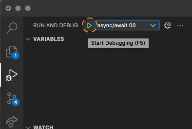

# Fun with Promises

## How to run the exercises

**Add a breakpoint in the main** function in the exercise you want to check.

Go to debug option and select the exercise in the select list

Click on the play button and enjoy

## Exercise 00

Create function _f3_. This function must to:

- call f1 with 4
- call f2, with the result of f1
- return f1 + f2

Call _f3_ function into _main_ function.

## Exercise 01

Create function _f3_. This function must to:

- call f1 with 5
- call f2 with 2
- return f1 + f2 

Call _f3_ function into _main_ function.

## Exercise 02

Create function _f3_. This function must to:

- call f1 with 4
- call f2 with the result of f1
- return the value of f2

Call _f3_ function into _main_ function.

